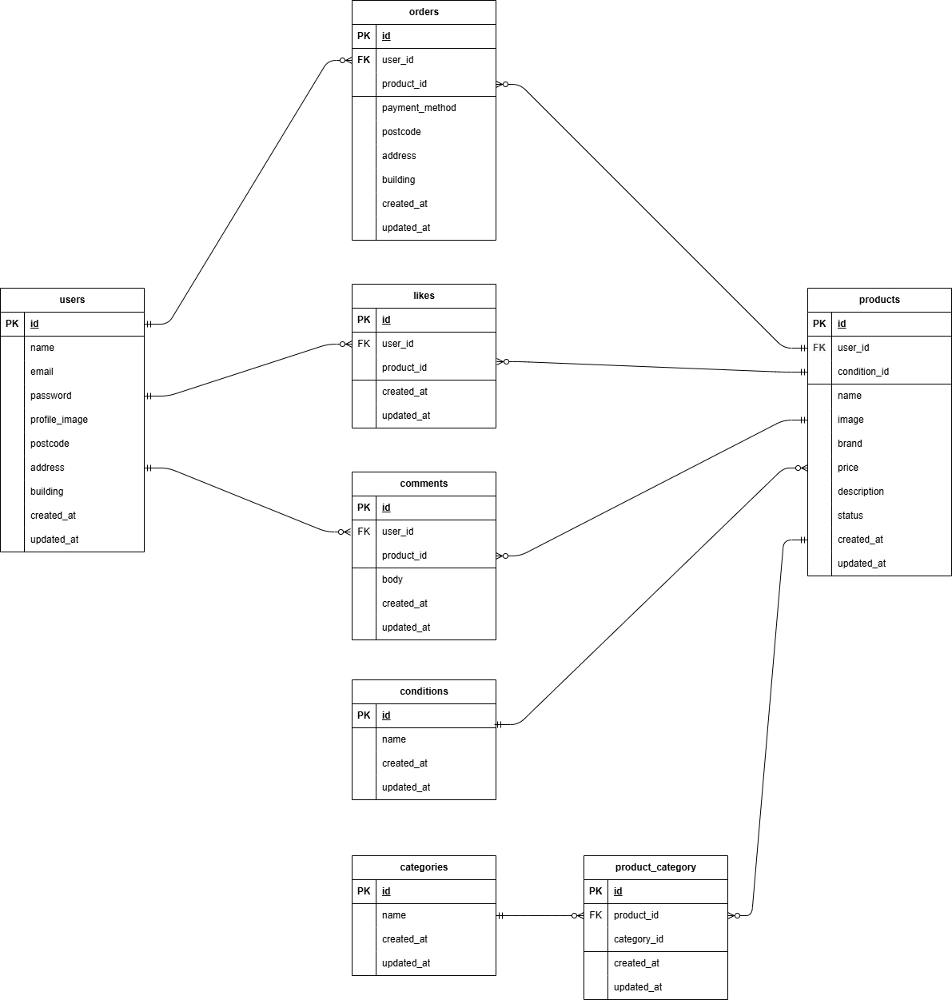

# アプリケーション名
resale-app（フリマアプリ）

## 環境構築手順
1. このリポジトリをクローン  
   `git clone git@github.com:sugamura-aya/resale.git`
   
2. `docker-compose.yml` ファイル内の `php:` に以下を追記
   ```yaml
   user: "1000:1000"
   
3. PHPバージョン確認・修正
   `docker/php/Dockerfile` を開き、PHPのベースイメージが `FROM php:8.1-fpm` になっているか確認・修正。
   
4. Dockerイメージをビルド  
   `docker-compose up -d --build`
   
5. ファイル権限変更  
   `sudo chown -R $USER:$USER .`

6. PHPコンテナにログイン  
   `docker-compose exec php bash`
    
7. .env.exampleを.envにコピーして、以下の内容に変更
   ```env
   DB_HOST=mysql  
   DB_DATABASE=laravel_db  
   DB_USERNAME=laravel_user  
   DB_PASSWORD=laravel_pass
   ```
   
8. パッケージインストール  
   `composer install`

9. アプリキーの生成  
   `php artisan key:generate`

10. Dockerイメージを一旦コンテナを完全停止・削除、設定を反映して再構築＆起動  
   `docker-compose down`  
   `docker-compose up -d --build`  

11. マイグレーション実行  
   `php artisan migrate`

12. ダミーデータ投入（ファクトリ使用）  
    `php artisan db:seed`

13. シンボリックリンクの作成
    `php artisan storage:link`

## 使用技術・実行環境
このアプリケーションは Laravel と Docker を用いて構築しています。
- Laravel 8.83.8（composer.json 参照）
- PHP 8.1.32（Docker）
- MySQL 8.0.26（Docker）
- Docker 27.5.1
- Docker Compose v2.32.4

※より詳細な環境情報は composer.json および docker-compose.yml をご参照ください。

## ER図
※ ER図は下記画像を参照



## URL
- 商品一覧画面（トップ画面） : /
- 商品一覧画面（トップ画面）＿マイリスト : /?tab=mylist
- 会員登録画面 : /register
- ログイン画面 : /login
- 商品詳細画面 :/item/{item_id}
- 商品購入画面 : /purchase/{item_id}
- 送付先住所変更画面 : /purchase/address/{item_id}
- 商品出品画面 : /sell
- プロフィール画面 : /mypage
- プロフィール編集画面（設定画面） : /mypage/profile
- プロフィール画面_購入した商品一覧 : /mypage?page=buy
- プロフィール画面_出品した商品一覧 : /mypage?page=sell

## テストユーザーのログイン情報
- 'name' :　テストユーザー
- 'email' : test@example.com
- 'password' : password

## 実装状況メモ
- 会員登録画面
  - ログイン画面で「会員登録はこちら」→会員登録画面へ遷移。
  - 「登録する」ボタン→DB登録→プロフィール編集画面（設定画面）へ遷移。
  - Fortifyで登録認証、パスワードのハッシュ化、バリデーション設定。
- ログイン画面
  - 「ログインする」ボタン→商品一覧画面（トップ画面）へ遷移。
  - 「会員登録はこちら」ボタン→会員登録画面へ遷移。
  - Fortifyでログイン認証、バリデーション設定。
- 商品一覧画面（トップ画面）
  - 全商品を表示（画像、商品名）。未認証ユーザーにも表示。購入済み商品には "Sold" を表示。自分が出品した商品は一覧に表示されない。おすすめ（全商品一覧）とマイリスト（いいねした商品一覧）をタブで表示切替。デフォルトではおすすめが表示。
  - マイリスト一覧：いいねした商品のみを表示。購入済み商品は "Sold" 表示。未認証ユーザーには何も表示されない。
  - 商品検索機能：ヘッダー内に検索欄を実装し、商品名での部分一致検索が可能。検索状態はマイリストでも保持される。
  - 未認証ユーザーが商品一覧画面（トップ画面）のヘッダー内「ログイン・マイページ・出品」ボタン→ログイン画面へ遷移。
- 商品詳細画面
  - 画像、名前、価格、いいね/コメント数、カテゴリ、商品説明など）を表示。複数カテゴリ表示に対応。未認証ユーザーにも表示。
  - いいね機能：アイコン押下で登録・解除が可能。アイコンの色変化と、いいね合計値の増減表示を実装。
  - コメント機能：ログインユーザーのみコメント送信可能。コメント数が増加表示される。バリデーション設定。
  - 「購入手続きへ」ボタン→商品購入画面へ遷移。
- 商品購入画面
  - 商品情報と、プロフィール登録済みの住所を初期値として表示。
  - 「購入する」ボタン押下で購入完了。購入商品は "Sold" 表示となり、「プロフィール/購入した商品一覧」に追加。遷移先は商品一覧画面。
  - 支払い方法選択：「コンビニ支払い」「カード支払い」を選択できる。小計画面に選択が反映される。
  - 配送先変更：商品購入画面から送付先住所変更画面に遷移し、変更した住所が購入画面に反映される。
  - バリデーション設定
- プロフィール画面 / マイページ
  - プロフィール画像、ユーザー名、出品した商品一覧、購入した商品一覧を表示。
  - 出品した商品一覧と購入した商品一覧をタブで表示切替。デフォルトでは出品した商品一覧が表示。
- プロフィール編集画面（変更画面）
  - （画像、名前、郵便番号、住所、建物名）の実装。画像はstorageに保存。
  - 「更新する」ボタン→商品一覧ページへ遷移。
  - バリデーション設定。
- 商品出品画面
  - 全項目（カテゴリ、状態、名前、価格など）の保存を実装。カテゴリは複数選択に対応。
  - ローカルからの画像選択・アップロードを実装し、storageディレクトリに保存。
  - 「出品する」ボタン→ 商品一覧ページへ遷移。
  - バリデーション設定。

## 未実装（応用要件）
- メールを用いた認証機能 
- 認証メール再送機能 
- Stripe決済画面への接続

## 補足（カスタム部分）
- 商品詳細画面：販売済み商品の「購入手続きへ」ボタン
  - 「購入は手続きへ」ボタンは「SOLD OUT」表記に、押下不可設定。
- 商品詳細画面：ログインユーザーが出品者本人ではない場合または未認証ユーザーの場合の「購入手続きへ」ボタン
  - 「購入は手続きへ」ボタンを表示。⇔ログインユーザーの場合はボタン非表示設定。


